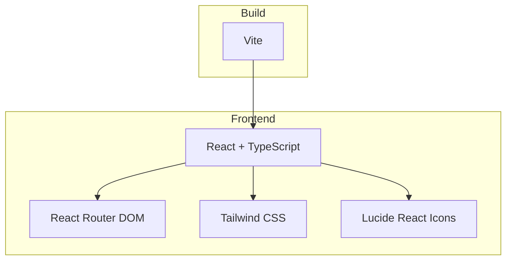

## 1. Architecture Design

## 2. Technology Description
- Frontend: React@18 + TypeScript + tailwindcss@3 + vite
- Initialization Tool: vite-init
- Backend: None
- Database: None

## 3. Route Definitions
| Route | Purpose |
|-------|---------|
| / | 首页 |
| /about | 关于我 |
| /skills | 专业技能 |
| /portfolio | 项目作品集 |
| /dashboard | 数据看板 |
| /pandas | Pandas训练项目 |

## 4. API Definitions
不适用

## 5. Server Architecture Diagram
不适用

## 6. Data Model
不适用
