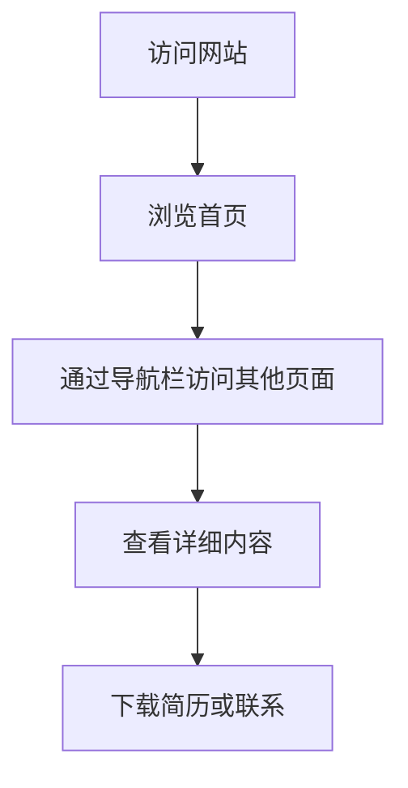

## 1. Product Overview
个人作品集网站，用于展示个人信息、专业技能、项目经验和课程学习情况。
- 主要用途是展示个人简历和作品集，目标用户是潜在雇主或合作伙伴
- 市场价值在于提供一个专业的个人品牌展示平台

## 2. Core Features

### 2.1 Feature Module
1. **首页**: 导航栏、英雄区（个人头像、姓名、简介）、课程展示、核心能力概览、项目亮点、页脚
2. **关于我**: 个人详细介绍
3. **专业技能**: 技能展示页面
4. **项目作品集**: 项目案例展示
5. **数据看板**: 数据可视化展示
6. **Pandas训练项目**: 训练项目页面

### 2.3 Page Details
| Page Name | Module Name | Feature description |
|-----------|-------------|---------------------|
| 首页 | 导航栏 | 固定顶部导航，包含所有页面链接 |
| 首页 | 英雄区 | 显示个人头像、姓名、学校专业、下载简历和联系按钮 |
| 首页 | 我的课程 | 展示6门核心课程，每门课程有详情和相关技能 |
| 首页 | 核心能力概览 | 展示个人优势能力 |
| 首页 | 项目亮点 | 展示3个主要项目 |
| 首页 | 页脚 | 包含关于本站、联系方式、快速链接 |

## 3. Core Process
用户访问网站 → 浏览首页了解基本信息 → 通过导航栏访问其他页面 → 查看详细内容 → 下载简历或联系

## 4. User Interface Design
### 4.1 Design Style
- 主色调：深蓝色（#0f172a）和浅蓝色（#38bdf8）
- 按钮风格：圆角按钮，带悬停效果
- 字体：现代无衬线字体，标题使用大号粗体
- 布局风格：卡片式布局，响应式设计
- 图标风格：使用lucide-react图标库

### 4.2 Page Design Overview
| Page Name | Module Name | UI Elements |
|-----------|-------------|-------------|
| 首页 | 英雄区 | 深蓝色背景，渐变色，居中布局，动画效果 |
| 首页 | 课程卡片 | 卡片式设计，悬停效果，包含课程详情和技能标签 |
| 首页 | 能力概览 | 网格布局，图标+文字描述 |

### 4.3 Responsiveness
- 桌面端优先设计
- 移动端自适应布局
- 触摸优化的交互元素

### 4.4 3D Scene Guidance
不适用
